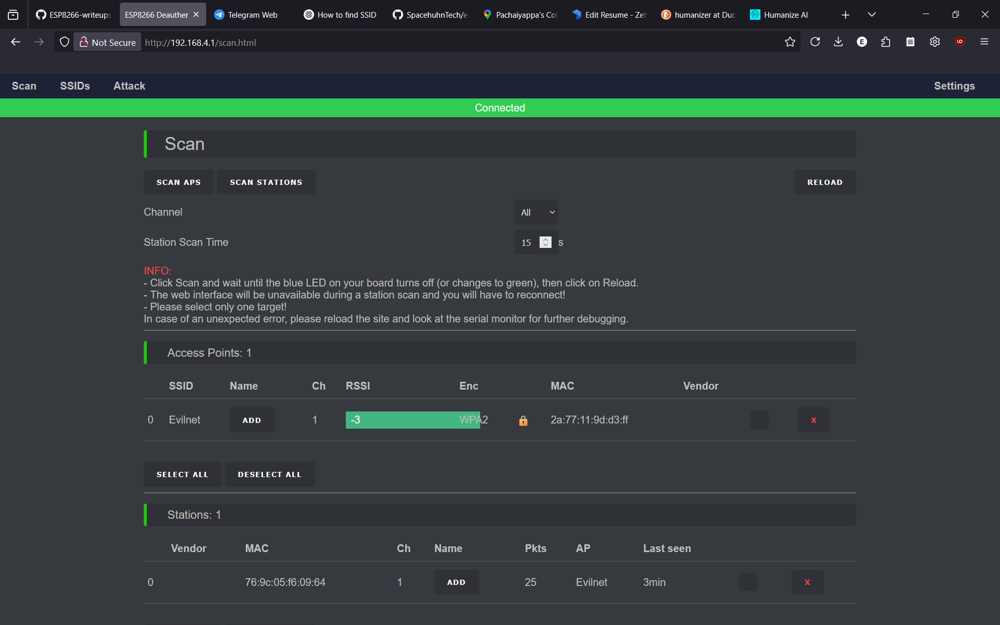

# ESP8266 Wi-Fi Deauthentication Attack (Lab Writeup)

**Author:** A S Sumith  
**Lab Type:** Wireless Security  
**Date:** [Add Date]

---

## 🎯 Objective

Demonstrate how an ESP8266 running *Deauther* firmware can send Wi-Fi deauthentication packets to kick devices off a Wi-Fi network in a controlled lab environment.

---

## 🧰 Tools Used

| Tool | Purpose |
|------|---------|
| **ESP8266 NodeMCU** | Low-cost microcontroller with Wi-Fi |
| **Deauther Firmware** | Open-source tool for sending deauth packets |
| **Laptop / Phone** | Connects to test Wi-Fi network |
| **Separate Test AP** | Target network, not used for real traffic |

---

## 🗂️ Lab Setup

1. Set up a **test Wi-Fi AP**:  
   - SSID: `LabNetwork`
   - Open or WPA2 (doesn’t matter for deauth)

2. Connect a test device (phone/laptop) to `LabNetwork`.

3. Flash **ESP8266** with [ESP8266 Deauther](https://github.com/SpacehuhnTech/esp8266_deauther).

4. Connect to ESP8266 web interface:
   - ESP hosts its own AP, usually `pwned` or `deauther`.

---

## ⚙️ Attack Steps

✅ 1. Scan for Wi-Fi networks in the Deauther interface.

✅ 2. Select `LabNetwork` as the target AP.

✅ 3. Select a client (your test device).

✅ 4. Start **deauth attack** → ESP8266 repeatedly sends deauthentication frames to the AP and client.

✅ 5. Observe:
   - Client drops from Wi-Fi repeatedly.
   - AP logs may show lots of disconnections.

✅ 6. Stop the attack → client reconnects normally.

---

## 📸 Evidence

  
*ESP8266 Deauther web interface*

  
*Test laptop repeatedly disconnected*

---

## ✅ What I Learned

- Wi-Fi deauth is a **management frame abuse** — unencrypted by design.
- Works even if WPA2 encryption is used.
- Such attacks can be performed cheaply (~$5 device).
- Highlights why modern networks should use:
  - 802.11w (Protected Management Frames — PMF)
  - Good AP placement & monitoring
  - IDS for unusual Wi-Fi activity

---

## 🔒 Mitigation

✔️ Enable **PMF** (Protected Management Frames) in AP/router.  
✔️ Use strong WPA2/WPA3 encryption (this doesn’t stop deauth, but stops other attacks).  
✔️ Use 5GHz band — less common on older deauth tools.  
✔️ Monitor for excessive disconnections.

---

## ⚠️ Legal & Ethical Note

- This test was done on my own lab AP and my own devices.
- Never run this on a network you do not own or have explicit permission to test.
- Deauthentication attacks are illegal on public or production networks.

---

## 📚 References

- [ESP8266 Deauther GitHub](https://github.com/SpacehuhnTech/esp8266_deauther)
- [802.11 Wi-Fi Management Frames](https://en.wikipedia.org/wiki/IEEE_802.11#Management_frames)

---

## ✅ Summary

This simple wireless security lab demonstrates:
- How easy it is to disrupt Wi-Fi connections.
- Why Wi-Fi security must cover more than just encryption.
- How defenders can spot and prevent these attacks.

---
